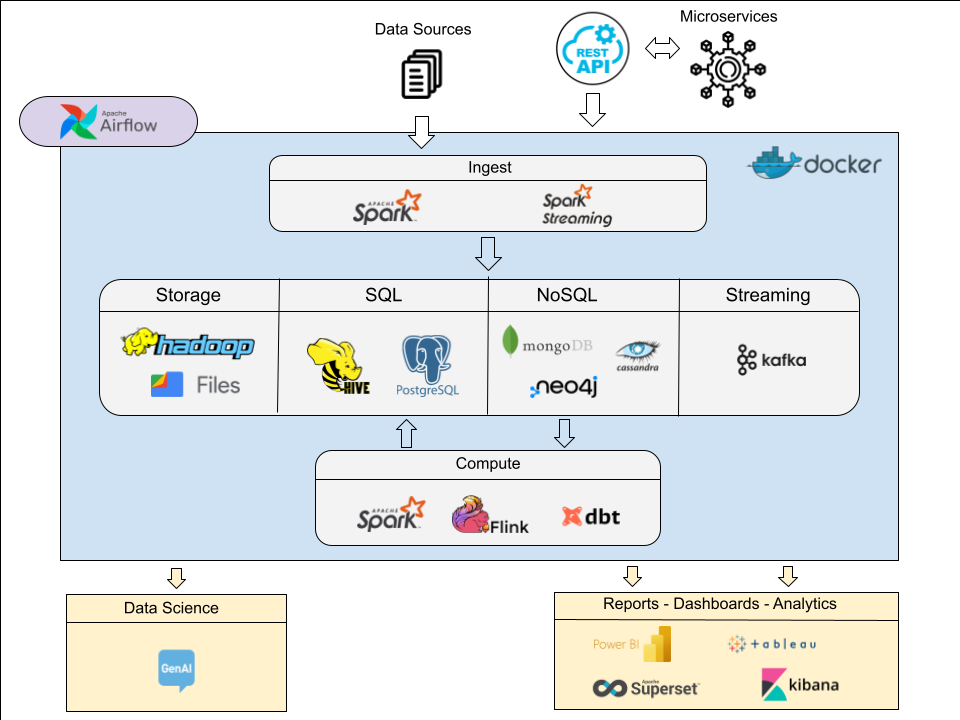
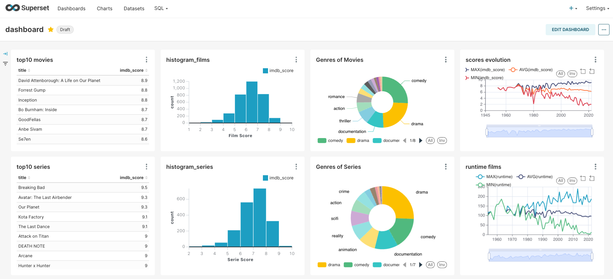

# My Data Lake

Welcome to my personal data lake to practice and integrate cutting-edge technologies in data management. Created as a hands-on learning project, it serves as a comprehensive platform for exploring, implementing, and refining data storage, processing and analysis techniques. 

## Authors

- [@ManuelMontero](https://www.linkedin.com/in/manuel-montero/)

## On-premise architecture

### Repositories

1. MyDataLake: https://github.com/Manuelms1993/MyDatalake
2. MyDockers: https://hub.docker.com/u/manuelms1993   
3. Ingest: https://github.com/Manuelms1993/mydlk-ingestion
4. Compute 
    * dbt: https://github.com/Manuelms1993/mydlk-dbt
5. Dashboards: https://github.com/Manuelms1993/mydlk-dashboard

### Database Structure
This section describes the database structure implemented in the data lake, which consists of various main databases adapted to the different stages of data processing and analysis.
- Raw Database: Initial landing area for raw, unprocessed data from various sources.
- Stream Database: Real-time data processing and analysis for streaming data.
- BI Database: Optimized for business intelligence and analytics.

### Compute (raw data to BI database)
The compute process involves a few stages of data transformation and processing to ensure that raw data is refined, aggregated, and prepared for business intelligence and analytics purposes.

### Dashboards
This section presents various dashboards and data analysis projects created with different visualisation and analysis tools. These dashboards provide information on various pre-processed datasets.

##### Superset

